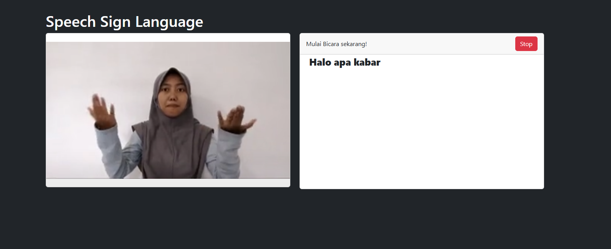
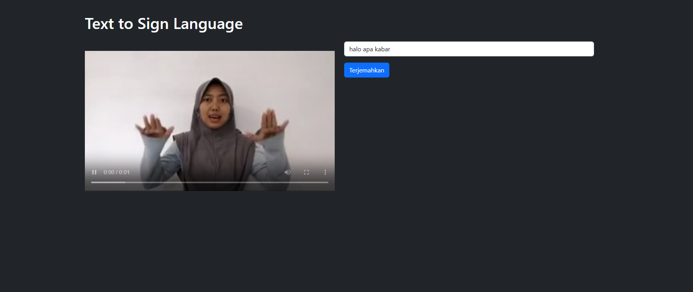

# Speech to Sign Language and Text to Sign Language Application

## Overview
This application is an innovative tool designed to bridge communication gaps for the hearing and speech-impaired community. It provides two main functionalities:

1. **Speech to Sign Language**: Converts spoken words into corresponding sign language representations.

2. **Text to Sign Language**: Converts written text into sign language representations.

## Application Workflow

### Endpoints

1. `/text-sign-language`:
   - Renders the page for text-to-sign conversion.

2. `/speech-sign-language`:
   - Renders the page for speech-to-sign conversion.

3. `/process_input`:
   - Accepts POST requests with text input and returns recognized words, associated videos, and categories in JSON format.

4. `/process_speech`:
   - Accepts POST requests with recognized speech (as text) and returns the same JSON response structure as `/process_input`.

### Backend Logic
- The `get_video_list` function handles text processing, breaking it into words and mapping them to predefined video categories.
- Input validation ensures proper error messages for unrecognized or invalid input.

---

